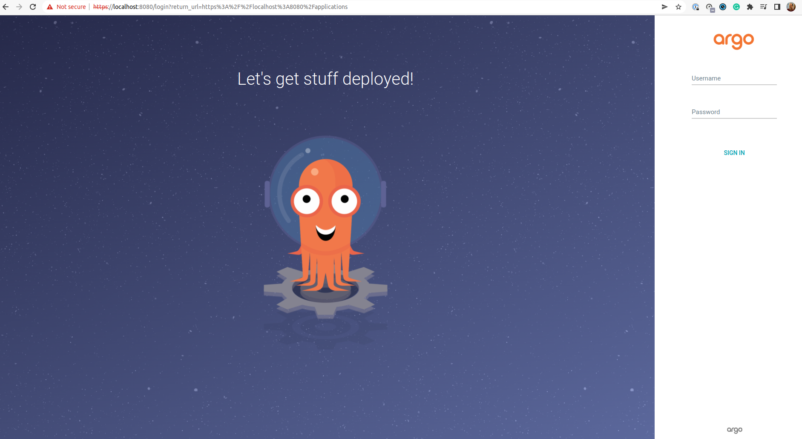
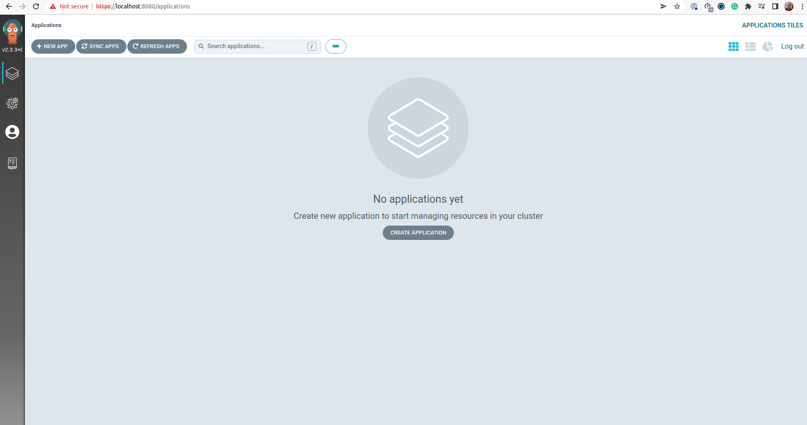

ArgoCD is a declarative GitOps continuous delivery tool built to deploy applications to Kubernetes. The goal of this demo is to install ArgoCD in a Kubernetes cluster and try out a few of its features.

Requirements:
- Minikube
- kubectl
- kubeconfig (Minikube creates it automatically in `~/.kube/config`)

I will be following the [ArgoCD getting started guide](https://argo-cd.readthedocs.io/en/stable/getting_started/) for the initial steps.


### 1. Start the Minikube Kubernetes Cluster and Install ArgoCD
Start the Cluster
```bash
minikube start
```
Then install ArgoCD
```bash
kubectl create namespace argocd
kubectl apply -n argocd -f https://raw.githubusercontent.com/argoproj/argo-cd/stable/manifests/install.yaml
```
Finally, check the pods in `argocd` namespace are running

    
```bash
k get pods -n argocd

NAMESPACE     NAME                                                READY   STATUS    RESTARTS   AGE
argocd        argocd-application-controller-0                     1/1     Running   2          7h3m
argocd        argocd-applicationset-controller-66689cbf4b-wpg2t   1/1     Running   2          7h3m
argocd        argocd-dex-server-7f444984f8-hxsjr                  1/1     Running   1          7h3m
argocd        argocd-notifications-controller-5f9b867666-dcdzh    1/1     Running   1          7h3m
argocd        argocd-redis-584f4df7d7-jjw5h                       1/1     Running   1          7h3m
argocd        argocd-repo-server-69c7dd7c9-f8828                  1/1     Running   1          7h3m
argocd        argocd-server-c6c9c4996-t89fw                       1/1     Running   1          7h3m
```

### 2. Download ArgoCD CLI
``` bash
sudo curl -sSL -o /usr/local/bin/argocd \
https://github.com/argoproj/argo-cd/releases/latest/download/argocd-linux-amd64
sudo chmod +x /usr/local/bin/argocd
```
Check if the `argocd` binary is working by running
```bash 
argocd version
```

### 3. Access The ArgoCD API Server

The documentation states that one can expose ArgoCD API server with a service type Load Balancer, Ingress or Port Forwarding. Since we are using a local tool such as Minikube, I'll pick port-forwarding which won't expose the server per se, but it will allow me to connect to it on `localhost:8080` on the browser.

```bash
kubectl port-forward svc/argocd-server -n argocd 8080:443
```
You can now visit `localhost:8080` and it should display the following



The password for the initial `admin` account is stored as a secret named `argocd-initial-admin-secret` in the ArgoCD namespace. To check that secret run
```bash
k get secrets -n argocd argocd-initial-admin-secret -o yaml
```
In my cluster I get
```bash
apiVersion: v1
data:
  password: NmFZd29tUFk1ZHltUm1vUA==
kind: Secret
metadata:
  creationTimestamp: "2022-05-13T14:07:08Z"
  name: argocd-initial-admin-secret
  namespace: argocd
  resourceVersion: "974"
  uid: ca35767f-8b6b-4f33-9022-047aa6f6fcc1
type: Opaque
```
The secret is base-64 encoded so to get it and decode it I can run
```bash
kubectl -n argocd get secret argocd-initial-admin-secret \
-o jsonpath="{.data.password}" | base64 -d; echo
6aYwomPY5dymRmoP
```
With this password, I can now login into my account's empty dashboard.



Don't forget to delete the Kubernetes secret `argocd-initial-admin-secret` and store the password in a safe location.

So far so good, let's continue on [part 2](https://torresdacosta.com/argocd-demo-part-2) of this series.