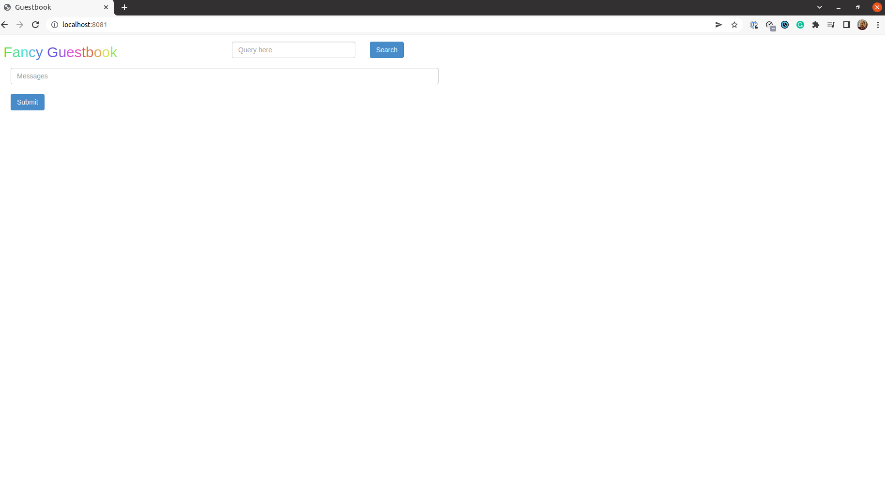

This is the continuation of [part 1](https://torresdacosta.com/argocd-demo-part-1) of this series.

\-- 

### 4. Login via the CLI
On the previous step, we were able to access the server via the browser. However, we also want to be able to talk to it using the CLI.

There are different ways to log in.

```bash
argocd login
```
returns
```bash
Log in to Argo CD

Usage:
  argocd login SERVER [flags]

Examples:
# Login to Argo CD using a username and password
argocd login cd.argoproj.io

# Login to Argo CD using SSO
argocd login cd.argoproj.io --sso

# Configure direct access using Kubernetes API server
argocd login cd.argoproj.io --core
```
To start off, we want to log in using the initial admin username and password. The `SERVER` is `localhost:8080` because we are port-forwarding the Kubernetes service that exposes the Kubernetes API server. As such, we run,
```bash
argocd login localhost:8080
```
and then input the details
```bash
WARNING: server certificate had error: x509: certificate signed by unknown authority. Proceed insecurely (y/n)? y
Username: admin
Password: 
'admin:login' logged in successfully
Context 'localhost:8080' updated
```

We're in. Before we forget, let's change the default password to something else, for example `poor-password`.

```bash
argocd account update-password
```
We can also now probably get some more information from my account. 
```bash
argocd account get-user-info
Logged In: true
Username: admin
Issuer: argocd
Groups: 
```
```bash
argocd account get
Name:               admin
Enabled:            true
Capabilities:       login

Tokens:
NONE
```

### 5. Register a Cluster to deploy apps to

Now, the fun begins. Let's connect our ArgoCD installation to a Kubernetes cluster. We are keeping things simple, so let's connect to the cluster where ArgoCD itself is running. To provide ArgoCD with the target Kubernetes cluster context name (here it's `minikube`), we run
```bash
argocd cluster add minikube
WARNING: This will create a service account `argocd-manager` on the cluster referenced by context `minikube` with full cluster level admin privileges. Do you want to continue [y/N]? y
INFO[0004] ServiceAccount "argocd-manager" created in namespace "kube-system" 
INFO[0004] ClusterRole "argocd-manager-role" created    
INFO[0004] ClusterRoleBinding "argocd-manager-role-binding" created 
Cluster 'https://192.168.49.2:8443' added

```
If you are wondering where the cluster API server IP address comes from, it's from the kubeconfig file stored locally which matches it with the context `minikube`. As for the command we just ran, it creates a service account which is bound to an admin level cluster role to allow ArgoCD to do its work. You can get its details by running
```bash
k get clusterrolebindings.rbac.authorization.k8s.io \
   argocd-manager-role-binding -o yaml

apiVersion: rbac.authorization.k8s.io/v1
kind: ClusterRoleBinding
metadata:
  creationTimestamp: "2022-05-15T22:16:26Z"
  name: argocd-manager-role-binding
  resourceVersion: "15356"
  uid: d7c7e025-2b07-43a3-a93c-0fd7291269ad
roleRef:
  apiGroup: rbac.authorization.k8s.io
  kind: ClusterRole
  name: argocd-manager-role
subjects:
- kind: ServiceAccount
  name: argocd-manager
  namespace: kube-system
```

### 6. Create an ArgoCD application from a Git repository

Now that ArgoCD is installed, the next step is to link it to a git repository which will be in sync with what gets deployed onto the Kubernetes cluster. The [Getting Started Guide](https://argo-cd.readthedocs.io/en/stable/getting_started/) suggests a repository with a simple application called *Guestbook* for testing purposes. The link is `https://github.com/argoproj/argocd-example-apps.git` and the folder is `guestbook`. To register the application in ArgoCD server (not yet deployed in Kubernetes) run the following
```bash
argocd app create guestbook \
  --repo https://github.com/argoproj/argocd-example-apps.git \
  --path guestbook \
  --dest-server https://kubernetes.default.svc \
  --dest-namespace default
```

`--repo` is the location of the git repository, `--path` is the root folder of the application we are interested in, `--dest-server` is the kubernetes api-server service and `--dest-namespace` is the namespace where the application will be deployed to in the destination cluster.

At this point, if we go into the cluster and check the pods and services, there is no difference. That is because ArgoCD and the repository are out of sync. We can see that by running `argocd app get guestbook` and checking `Sync Status`. To sync them we have to run 
```bash
argocd app sync guestbook

TIMESTAMP                  GROUP        KIND   NAMESPACE                  NAME    STATUS    HEALTH        HOOK  MESSAGE
2022-05-16T00:31:24+01:00            Service     default          guestbook-ui  OutOfSync  Missing              
2022-05-16T00:31:24+01:00   apps  Deployment     default          guestbook-ui  OutOfSync  Missing              
2022-05-16T00:31:24+01:00            Service     default          guestbook-ui    Synced  Healthy              
2022-05-16T00:31:24+01:00            Service     default          guestbook-ui    Synced   Healthy              service/guestbook-ui created
2022-05-16T00:31:24+01:00   apps  Deployment     default          guestbook-ui  OutOfSync  Missing              deployment.apps/guestbook-ui created
2022-05-16T00:31:24+01:00   apps  Deployment     default          guestbook-ui    Synced  Progressing              deployment.apps/guestbook-ui created

Name:               guestbook
Project:            default
Server:             https://kubernetes.default.svc
Namespace:          default
URL:                https://localhost:8080/applications/guestbook
Repo:               https://github.com/argoproj/argocd-example-apps.git
Target:             
Path:               guestbook
SyncWindow:         Sync Allowed
Sync Policy:        <none>
Sync Status:        Synced to  (53e28ff)
Health Status:      Progressing

Operation:          Sync
Sync Revision:      53e28ff20cc530b9ada2173fbbd64d48338583ba
Phase:              Succeeded
Start:              2022-05-16 00:31:24 +0100 WEST
Finished:           2022-05-16 00:31:24 +0100 WEST
Duration:           0s
Message:            successfully synced (all tasks run)

GROUP  KIND        NAMESPACE  NAME          STATUS  HEALTH       HOOK  MESSAGE
       Service     default    guestbook-ui  Synced  Healthy            service/guestbook-ui created
apps   Deployment  default    guestbook-ui  Synced  Progressing        deployment.apps/guestbook-ui created
```

To check that the application has been deployed into the Kubernetes cluster, we can confirm whether `guestbook` resources were deployed onto the `default` namespace:
```bash
k get all 
NAME                                READY   STATUS    RESTARTS   AGE
pod/guestbook-ui-85985d774c-8mzl6   1/1     Running   0          15m

NAME                   TYPE        CLUSTER-IP      EXTERNAL-IP   PORT(S)   AGE
service/guestbook-ui   ClusterIP   10.106.169.43   <none>        80/TCP    15m
service/kubernetes     ClusterIP   10.96.0.1       <none>        443/TCP   2d9h

NAME                           READY   UP-TO-DATE   AVAILABLE   AGE
deployment.apps/guestbook-ui   1/1     1            1           15m

NAME                                      DESIRED   CURRENT   READY   AGE
replicaset.apps/guestbook-ui-85985d774c   1         1         1       15m
```
Indeed they have. Finally, to double-check, we can port forward the `guestbook`service onto the localhost with `kubectl port-forward svc/guestbook-ui -n default 8081:80` and see if a UI shows up.



Hooray! The application is live! At least locally :grinning:

In [part 3](https://torresdacosta.com/argocd-demo-part-3), we'll create our own git repository with our own application and see check what happens when we do changes. See you soon!