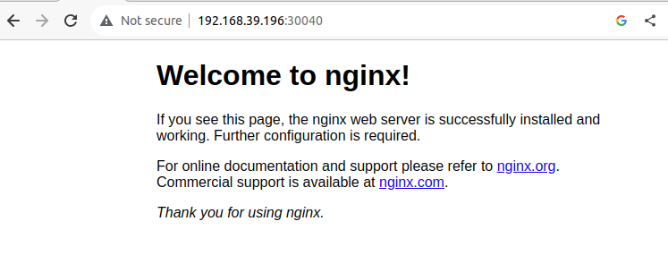

See [this post](https://ricardotorresdacosta.com/what-helm-solves/) to have a gentle overview of why Helm exists.

# 30-Day Plan to learn Helm
I drafted the following plan and will content to each topic in this page as I progress.
## Week 1: Introduction and Basics

- [**Day 1-3**](#day-1-3): Learn the basics of Kubernetes and why Helm is necessary. Install Helm and setup your environment. Understand basic Helm commands.
- [**Day 4-6**](#day-4-6): Learn what a Helm Chart is. Understand the structure of a Helm Chart. Start creating a basic Helm Chart.
- **Day 7**: Review the concepts learnt and practice them.
## Week 2: Charting and Releases

- [**Day 8-10**](#day-8-10): Learn how to use Helm templates. Understand Helm functions and pipelines. Explore Helm dependencies and managing multiple charts.
- **Day 11-13**: Learn how Helm manages releases and their lifecycle. Practice installing, upgrading, and rolling back releases. Understand how to check the status and history of a release.
- **Day 14**: Review the concepts learnt and practice them.
## Week 3: Customizing Charts and Security

- **Day 15-17**: Use Helm Hub/Artifact Hub to search and install public charts. Learn how to customize public charts with a values file.
- **Day 18-20**: Learn how to secure your Helm installation. Understand how to sign and verify Helm charts. Learn Helm best practices.
- **Day 21**: Review the concepts learnt and practice them.
## Week 4: Repositories and Plugins

- **Day 22-24**: Learn how to create your own Helm Chart repoasitory. Understand how to package and host your charts. Learn how to use GitHub Pages for hosting Helm charts.
- **Day 25-27**: Learn about Helm plugins and how to use them. Understand how to manage cluster-wide resources with Helm. Learn how to use Helm with CI/CD pipelines.
- **Day 28**: Review the concepts learnt and practice them.
## Week 5: Review and Practical Application

- **Day 29**: Build and deploy a real-world application using Helm Charts.
- **Day 30**: Participate in Q&A forums, contribute to open-source Helm projects, read official docs and blogs for advanced understanding.

# **Day 1-3** 
[(Back to plan)](#30-day-plan-to-learn-helm)

**Goal**: Learn the basics of Kubernetes and why Helm is necessary. Install Helm and setup your environment. Understand basic Helm commands.

## Helm Installation and Setup

There are a number of [ways for installing Helm](https://helm.sh/docs/intro/install/). My preferred way is using their recommended script:
  ```bash
  $ curl -fsSL -o get_helm.sh https://raw.githubusercontent.com/helm/helm/main/scripts/get-helm-3
  $ chmod 700 get_helm.sh
  $ ./get_helm.sh
  ```

  It installs helm binary into `/usr/local/bin/helm/`

## Install a chart

Let's install an Nginx webserver using a Helm chart. 

1. First let's get a Kubernetes cluster locally. I use minikube for most of my local development. If you have it installed, running `minikube start` deploys the cluster of a KVM2 VM. Your local kubeconfig changes context to point to this freshly created minikube cluster. You can get an overview of the cluster by running `kubectl get all -A`.
1. Now let's add a repository which contains the desired chart. Bitnami is a company that, among other things, packages software. They have a widely used Helm chart of Nginx. To add the repository:

    ```bash
    $ helm repo add bitnami https://charts.bitnami.com/bitnami
    ```
You can run `helm repo list` to check whether it was added to the list of repos. Then,
    ```bash
    $ helm repo update
    ```
To get the latest updates.
1. Next, we install the Nginx chart from bitnami repository:
    ```bash
    $ helm install my-nginx bitnami/nginx
    ```
1. Then we can check whether it exists
    ```bash
    $ kubectl get svc
    NAME         TYPE           CLUSTER-IP    EXTERNAL-IP   PORT(S)        AGE
    kubernetes   ClusterIP      10.96.0.1       <none>        443/TCP        4m14s
    my-nginx     LoadBalancer   10.106.29.180   <pending>     80:30040/TCP   15s
    ```
1. It does exist, however how can I access it from outside the cluster? I can't at the moment because this is a service of type LoadBalancer and usually that works only with cloud providers. To make it work locally, I can swap it for NodePort type. The way to do that is by replacing the type in the `values.yaml` file of the chart. I can get it by running the following command:
    ```bash
    $ helm show values bitnami/nginx > values.yaml
    ```
Then, in that file I will replace the section
    ```yaml
    service:
      type: LoadBalancer
      ports:
    ```
with
    ```yaml
    service:
      type: NodePort
      ports:
    
    ```
After the change, I need to run a `helm upgrade` command:
    ```bash
    $ helm upgrade my-nginx bitnami/nginx -f values.yaml
    ```
I can now check if the service type has changed:
    ```bash
    $ kubectl get svc
    NAME         TYPE           CLUSTER-IP    EXTERNAL-IP   PORT(S)        AGE
    kubernetes   ClusterIP   10.96.0.1       <none>        443/TCP        10m10s
    my-nginx     NodePort    10.106.29.180   <none>        80:30040/TCP   10m29s
    ```
Indeed it has. Finally, to test external connectivity I can get the node ip address (recall this is a KVM2 VM) in different ways, for example with `$ ip a`. The easiest way though is to simply run
    ```bash
    $ minikube service my-nginx --url
    http://192.168.39.196:30040
    ```
Putting that in the browser should display the familiar Nginx welcome page!


## Release Installs and Upgrades

`helm install` installs a chart instance, ie it creates a **release**. In turn, `helm upgrade` upgrades a release to a new **revision**. There are several use cases for upgrades:

1. New Version of the Chart: When there's an updated version of the chart you've installed, and you want to update your release to use this new version.

1. Configuration Changes: If you want to change the configuration of an already deployed release. For example, you initially deployed a chart with a certain set of values, and now you want to adjust those values. Instead of deleting and reinstalling the release, you can just use helm upgrade with the new values.

1. Rollbacks: Although Helm provides a helm rollback command to revert a release to a previous revision, you can technically use helm upgrade to manually revert to an older version of a chart or a known set of values.

1. Chart Development: If you are a chart developer, you might frequently use helm upgrade to test changes in your chart. As you make changes to the templates or default values, you can use helm upgrade to apply those changes to a running release.

1. Applying Patches: Sometimes, charts may have bugs or vulnerabilities that get fixed in newer versions. When patches are released, you can use helm upgrade to apply these patches to your release.

1. Taking Advantage of New Features: When newer versions of applications (or the charts that deploy them) introduce new features, you can use helm upgrade to deploy these new features.


# **Day 4-6** 
[(Back to plan)](#30-day-plan-to-learn-helm)

**Goal**: Learn what a Helm Chart is. Understand the structure of a Helm Chart. Start creating a basic Helm Chart.

## [Three Big Concepts](https://helm.sh/docs/intro/using_helm/) 

> A **Chart**  is a Helm package. It contains all of the resource definitions necessary to run an application, tool, or service inside of a Kubernetes cluster. Think of it like the Kubernetes equivalent of a Homebrew formula, an Apt dpkg, or a Yum RPM file.
>
> A **Repository**  is the place where charts can be collected and shared. It's like Perl's CPAN archive or the Fedora Package Database, but for Kubernetes packages.
>
> A **Release**  is an instance of a chart running in a Kubernetes cluster. One chart can often be installed many times into the same cluster. And each time it is installed, a new release is created. Consider a MySQL chart. If you want two databases running in your cluster, you can install that chart twice. Each one will have its own release, which will in turn have its own release name.
>
> With these concepts in mind, we can now explain Helm like this:
>
> **Helm installs charts into Kubernetes, creating a new release for each installation. And to find new charts, you can search Helm chart repositories.**

## The Structure of a Helm Chart

Here is the typical structure of a Helm chart:

```graphql
mychart/
│
├── .helmignore        # Patterns to ignore when building packages
│
├── Chart.yaml         # A YAML file containing information about the chart
│
├── values.yaml        # The default configuration values for this chart
│
├── values.schema.json # (Optional) A JSON Schema for imposing a structure on the values.yaml file
│
├── charts/            # A directory containing any charts upon which this chart depends.
│
├── templates/         # A directory of templates that, when combined with values, will generate valid Kubernetes manifest files.
│   ├── deployment.yaml
│   ├── service.yaml
│   ├── _helpers.tpl   # A place to put template helpers that you can re-use throughout the chart.
│   └── ...            # More Kubernetes resource templates
│
└── files/             # An optional directory of files. These files will not be templated but can be used by the chart.
    ├── my-logo.png
    └── ...
```
1. `Chart.yaml`: This file contains metadata about the Helm chart. This includes things like the chart's version, its description, and more.

1. `values.yaml`: This is where default configuration values for the chart are declared. These values can be overridden by users during `helm install` or `helm upgrade` with their own values.

1. `templates/`: This directory contains files that will be converted into Kubernetes manifest files when the chart is deployed. The files here use Go templating language. The naming of these files doesn't matter as long as they end in `.yaml` or `.tpl`.

1. `_helpers.tpl`: This is a special file in the `templates/` directory that's used for defining template helpers which can be reused across multiple templates in the chart.

1. `charts/`: If your chart has dependencies on other charts, they can be placed in this directory. This can be done manually, or Helm can manage the dependencies and put them here using the `helm dependency update` command.

1. `files/`: Any files in this directory will be bundled with the chart but will not be templated. They're often used to store things like config files or other static resources.

1. `.helmignore`: This is similar to `.gitignore`. It's a way to specify files or directories to ignore when packaging the chart.

1. `values.schema.json` (optional): If provided, this file offers a way to validate the `values.yaml` file to ensure that provided values are of the correct type, format, etc.

As you can see, a Helm chart provides a way to manage Kubernetes resources as a cohesive unit, making it easier to distribute, version, and manage complex applications on Kubernetes.

## Our first custom Helm Chart
Follow these steps to create and deploy our first custom Helm Chart. We will deploy another Nginx server. If you haven't uninstalled the previous one in minikube you can see the two releases side by side.
1. **Create a New Chart**:
Helm provides a command to scaffold a new chart directory structure:

    ```bash
    $ helm create my-custom-nginx
    ```
This will create a directory named my-custom-nginx with the basic chart structure in it.

1. **Understand the Basics**:
Navigate into the `my-custom-nginx` directory. The primary files and directories you should focus on are:  
    `Chart.yaml`: Metadata about the chart.    
    `values.yaml`: Default values for the chart.    
    `templates/`: Directory where Kubernetes resources are defined.    
1. **Update Chart Metadata**:
Open `Chart.yaml` in your favorite text editor and you'll see something like this:

    ```yaml
    apiVersion: v2
    name: my-custom-nginx
    description: A Helm chart for Kubernetes
    # ... other metadata ...
    ```
Update the description or any other metadata if you want.

1. **Define Our Application**: For this example, we'll be deploying a simple Nginx server. Open `values.yaml`. You'll see a lot of default values. For now, keep it simple. Replace only the service type for NodePort:

    ```yaml
    service:
      type: NodePort
      port: 80
    ```

1. **Update the Kubernetes Templates**: In the templates directory, there are several predefined resources. The two primary ones we'll focus on are:  
    `deployment.yaml`: This defines a Kubernetes Deployment for your application.  
    `service.yaml`: This defines a Kubernetes Service to expose your application.  
Most of the templating in these files will work with our simple `values.yaml`. So, no changes are strictly needed for our basic example. However, it's a good exercise to open these files and understand how values from values.yaml are used in these templates.

1. **Install the Chart**:
To install the chart onto your Kubernetes cluster:

    ```bash
    $ helm install my-custom-nginx ./my-custom-nginx
    ```
This command deploys the my-custom-nginx chart onto your cluster with the release name `my-custom-nginx`.

1. **Access the Application**:
You can see the deployed resources with:

    ```bash
    $ kubectl get all -l app.kubernetes.io/instance=my-custom-nginx
    ```
As before we can also check it on our browser by running 
    ```bash
    $ minikube service my-custom-nginx --url
    http://192.168.39.196:32665
    ```
and then accessing the IP address. At this stage, if you haven't deleted the Nginx deployment from Days 1-3, you can see that now you have two releases created in the cluster:

    ```bash  
    $ helm list
    NAME               	NAMESPACE	REVISION	UPDATED                                 	STATUS  	CHART                	APP VERSION
    my-custom-nginx    	default  	1       	2023-01-17 17:21:10.506994808 +0100 WEST	deployed	my-custom-nginx-0.1.0	1.16.0     
    my-nginx           	default  	3       	2023-01-17 17:02:05.253519017 +0100 WEST	deployed	nginx-15.1.3         	1.25.2 
    ```

1. **Clean Up**:
If you want to delete the release:

    ```bash
    $ helm uninstall my-custom-nginx
    ```
Congratulations! You've drafted and deployed your first Helm chart. As you become more familiar with Helm and Kubernetes, you can start defining more complex charts with multiple services, configurations, and dependencies.


---

TO BE CONTINUED